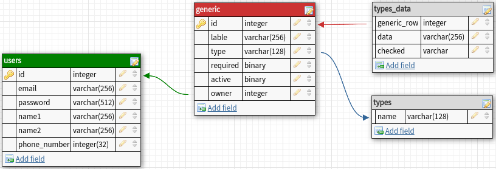

## Test Project Documenation

### Front End:  
---
#### Pages & data used:  
- Sign up (static)
  - email [VARCHAR]
  - password [VARCHAR]
  - 1name [VARCHAR]
  - 2name [VARCHAR]
  - phone number [BIGINT]
- Sign in (static)
  - email [VARCHAR] | phone number [BIGINT]
  - password [VARCHAR]
- Edit profile (generated)
  - email [VARCHAR]
  - 1name [VARCHAR]
  - 2name [VARCHAR]
  - phone number [BIGINT]
- Fields list (dynamic, generated [read table])
  - Rows
    - Label [VARCHAR]
    - Type [predefined]
    - Required [BOOLEAN]
    - isAcitive [BOOLEAN]
- Add field (Popup, Dialog) (static)
    - Label [VARCHAR]
    - Type [predefined]
      - Data for that type(options) [VARCHAR]
    - Required [BOOLEAN]
    - isAcitive [BOOLEAN]
- Questionnaire (generated)
- Responses (generated (from questionnaire input));
### Technologies used    

### DataBase  
---

#### Goal of the implementation  
What's need to be implemented:
#### Implementation  

- 
